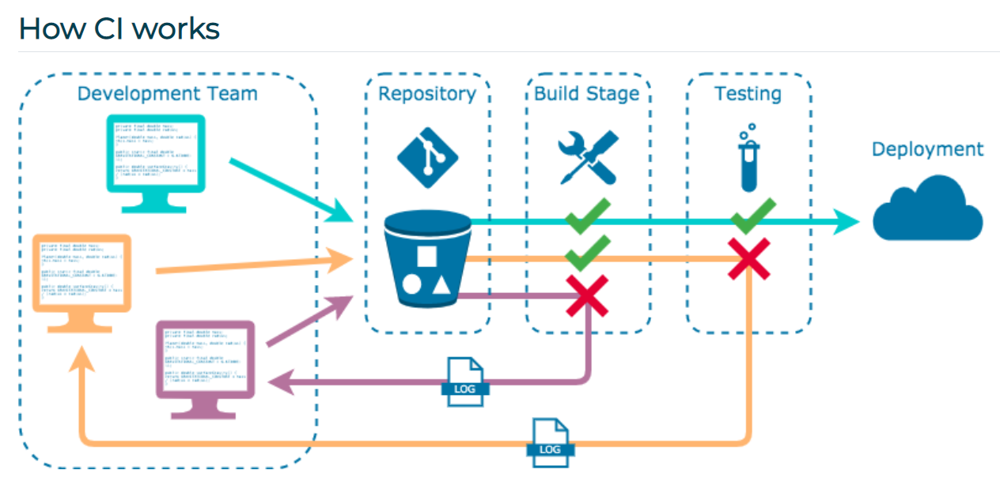
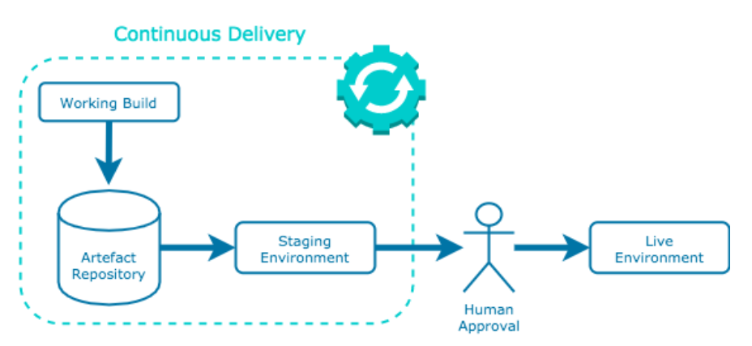
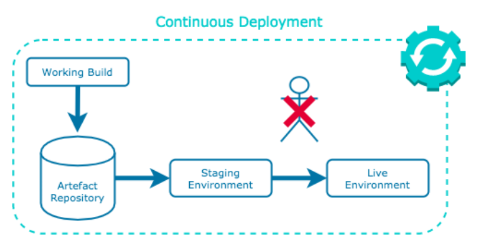
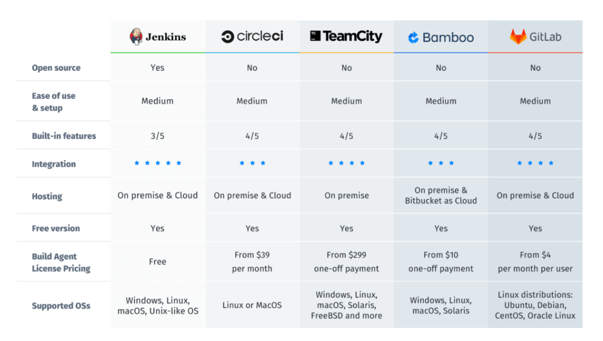
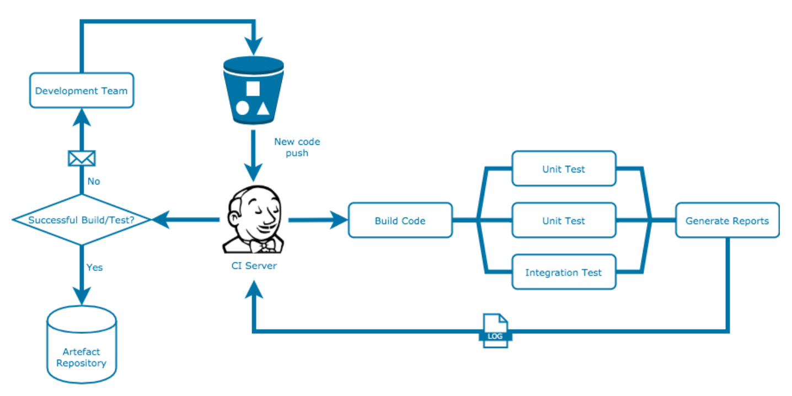

# CI/CD

## Continuous Integration (CI)

Continuous Integration (CI): Developers merge/commit code to master branch multiple times a day, fully automated build and test process which gives feedback within few minutes, by doing so, you avoid the integration hell that usually happens when people wait for release day to merge their changes into the release branch.

CI refers to the automated integration of code from many contributors into a single software project.

The purpose of the CI pipeline approach is to allow developers to integrate newly-generated code easily and frequently, and is achieved through the use of automated testing tools to check the correctness of code before full integration. Additional checks that may also be performed include syntax style, code quality, etc.

CI allows developers to generate and implement new functionality with ease and speed through automation of the integration process. Building and testing of new code is handled through automation, allowing developers to focus their efforts on the creation of new features.

Developers work on features independently and in parallel with each other, without having to worry about clashes within their teams. Tracking and merging code additions allows for smoother integration of new features without fear of irreparably damaging the source code.

### A continuous integration pipeline should:

- Maintain a single source code repository for a project
- Have a "master" branch that should always be ready to deploy
- Keep all team members informed of every update to the source code
- Automate build processes
- Automate testing of new builds
- Inform developers of test failures with detailed logs
- Encourage smaller, frequent deployments of code

# Automation

A DevOps culture encourages automation in as many areas of the production pipeline as possible. As a rule of thumb: if a machine could do it, a machine should be doing it.

## Benefits

There are a range of benefits to employing a CI pipeline to a production workflow that are not only limited to that of the developer and operations teams, but often positively affect the entire organisation.

This may be through cost-effectiveness, facilitating better planning, and greater transparency and understanding of underlying processes, allowing the company to better execute marketing strategies.

### 1) Scaling

CI cuts out a large chunk of overhead occupied by manual code building/testing, slow communication channels both within and outside of the team, and highly stratified team structures.

Freeing up this time and energy in the production workflow frees up resources that can go towards scaling up the development team, code generation, code integration, and more.

Overly-planned releases schedules can be abandoned for more frequent updates, scaling team productivity.

### 2) Feedback Loop

Frequent and gradual feature updates allow for far more opportunities for business feedback. Teams can test new design ideas, new features, and get feedback about them faster, allowing for an agile approach to product development.

It also allows for more client/customer feedback, as development teams can now show off new product features to the people they're being designed for, allowing them to adjust their product accordingly.

Incidentally, bugs and other issues can be rapidly fixed due to CI minimising the hassle needed for redeployment.

### 3) Communication

Leveraging VCS enhances communication between the teams as all changes are easily trackable. Teams and individuals are therefore more aware of each other's progress.

Stronger communication means teams/individuals avoid stepping on each other's toes and impeding each other's work.

Greater awareness of progress also aids transparency of work across the organisation. Other non-technical teams are much more able to review and understand what development teams are working on and how much they are achieving.

# Continuous Delivery and Continuous Deployment 

## Continuous Delivery

Continuous Delivery is an extension of continuous integration to make sure that you can release new changes to your customers quickly in a sustainable way. This means that on top of having automated your testing, you also have automated your release process and you can deploy your application at any point of time by clicking on a button. In continuous Delivery the deployment is completed manually.

Continuous delivery is an extension of the CI philosophy that seeks to deliver new features to customers on a regular basis. So while CI integrates code regularly, continuous delivery also delivers that code regularly.

It requires an automated process in place such that new releases only require approval via a click of a button to go live. This approach encourages organisations to deploy their applications as early as possible in smaller batches.

The product is ready (it was delivered) but it is still not deployed.

Netflix: some movies are ready (delivery) but still are not meant to be delivered to the public (deployment). The product is ready in the development environment but is not in the production environment yet.

## Continuous Deployment

Continuous Deployment goes one step further than continuous delivery, with this practice, every change that passes all stages of your production pipeline is released to your customers, there is no human intervention, and only a failed test will prevent a new change to be deployed to production.

Continuous deployment further extends the continuous delivery practice such that feature releases are entirely automated, requiring no human interaction for new application features to end up in the customer's hands.

Continuous deployment workflows have the benefit of eliminating the idea of a "release date", allowing developers to simply focus on creating new ideas without time constraints.

The product is deployed to the production environment.

## How CICD Practices relate to each other: 

To put it simply, the continuous integration is part of both continuous delivery and continuous deployment. The main difference is the deployment step, in continuous delivery the deployment is done manually and in continuous deployment it happens automatically.

What is a CI CD Pipeline: The CI/CD pipeline is all about automation: Initiating code builds, automated testing, and automated deploying to the staging or production environments. It’s complex and exciting at the same time, but incredibly fast, if the output of any stage fails, the next stage will also fail.

# Best CICD Tools to build Pipeline?

# Jenkins

Jenkins is an open-source automation server in which the central build and CI process take place, It is a Java-based program with packages for Windows, macOS, & Linux.

Great range of plugins available, Jenkins supports building, deploying, and automating for software development projects, easy installation, simple and user-friendly interface, extensible with huge community-contributed plugin resource, easy environment configuration in user interface & supports distributed builds with master-slave architecture.

Jenkins Pipeline (or simply "Pipeline" with a capital "P") is a suite of plugins which supports implementing and integrating continuous delivery pipelines into Jenkins.

The definition of a Jenkins Pipeline is written into a text file (called a Jenkinsfile) which in turn can be committed to a project’s source control repository.

Creating a Jenkinsfile and committing it to source control provides a number of immediate benefits:

Automatically creates a Pipeline build process for all branches and pull requests.
Code review/iteration on the Pipeline.
Audit trail for the Pipeline.
Single source of truth for the Pipeline, which can be viewed and edited by multiple members of the project.

